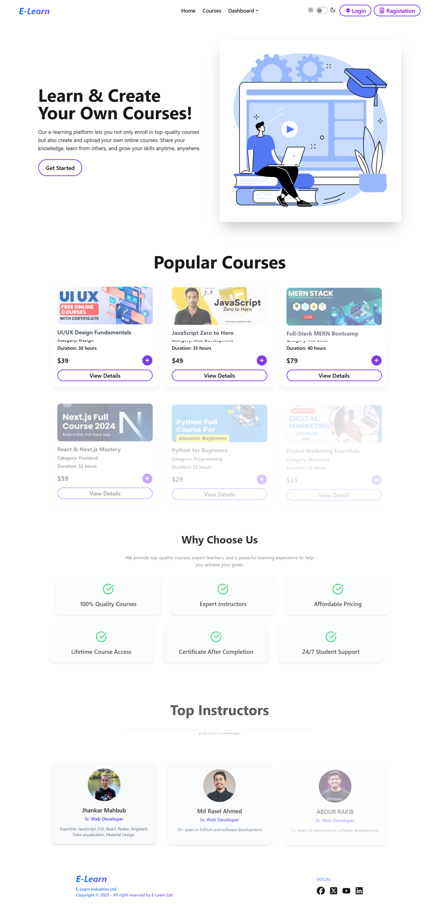

 # E-Learn
 

**Live Link:** [https://e-learn-akr.netlify.app/] 

## Purpose
E-Learn is a full-stack online learning platform designed to connect instructors and learners seamlessly. Users can explore, enroll, and manage courses while instructors can create and manage their own courses. The platform emphasizes smooth interaction, modern UI, responsive design, and efficient data management to provide an immersive learning experience.

## Key Features

- **Dynamic Navbar:**  
  - Shows **Login/Register** links when the user is logged out.  
  - Displays **user profile picture** and logout button when logged in.  
  - Dashboard links dynamically update according to the logged-in user.

- **Home Page:**  
  - Hero/Banner section with engaging visuals.  
  - Popular Courses section with 6 featured courses.  
  - Static sections: “Why Choose Us” and “Top Instructors.”  
  - Smooth animations implemented using **Framer Motion**.

- **Authentication:**  
  - Email/password login and registration.  
  - Google login integration.  
  - Password validation (minimum 6 characters, includes uppercase & lowercase letters).  
  - Users are redirected appropriately to private routes after login.

- **Course Management (CRUD):**  
  - Instructors can **Add, View, Update, and Delete** their courses.  
  - Users can **enroll** in courses and see their enrolled courses.  
  - Course data stored in **MongoDB** and images handled via **ImgBB**.  
  - Filtering functionality available on “All Courses” page.

- **Additional Features:**  
  - Loading spinners while fetching data.  
  - Custom **404 Not Found** page.  
  - Dynamic page titles and toast notifications.  
  - Fully responsive design with **Tailwind CSS** and **DaisyUI**.  
  - Dark/Light theme toggle functionality.

## Dependencies
- `react`  
- `react-router`  
- `react-icons`  
- `lucide-react`  
- `react-hot-toast`  
- `framer-motion`  
- `axios`  
- `firebase`  
- `tailwindcss`  
- `daisyui`  
- `@tanstack/react-query`  
- `MongoDB`  
- `Vercel`  
- `netlify`  